<div align="center">

# NIRNAY

### An indigenous LP / MILP / QP optimisation solver, written from the mathematics up

**Smart India Hackathon 2026 · Problem statement SIH26119 · Mangalore Refinery and Petrochemicals Ltd (MRPL)**<br>
*Indigenous GPU-Accelerated Optimization Solver (Sovereign Alternative to Xpress / CPLEX)* · **Team ZeroCloud · Team ID 175338**

*nirnay (निर्णय) — "decision"*

</div>

---

Every refinery plan, crude blend, production schedule and power dispatch runs on an optimisation
solver. In India those solvers are CPLEX, Gurobi or Xpress: foreign, licensed per seat, and closed.
NIRNAY is the engine itself, written in this repository from published mathematics. **No solver
library is imported anywhere in the solver.** The sparse LU, Cholesky and LDLᵀ factorisations, the
orderings, the simplex, interior-point and PDLP engines, branch-and-bound, cuts and presolve are all
here, and every answer is re-checked against an independent solver.

| | |
|---|---|
| 📊 **Idea deck** (SIH format, 6 slides + speaker notes) | [`deliverables/deck/ZeroCloud_SIH26119.pptx`](deliverables/deck/ZeroCloud_SIH26119.pptx) |
| 📘 **Technical report** (59 pages, every number generated from `results/`) | [`deliverables/report/main.pdf`](deliverables/report/main.pdf) |
| 🏭 **Industrial case studies** on Indian public data | [`docs/CASE_STUDIES.md`](docs/CASE_STUDIES.md) |
| 🔬 **Competitor study** — 8 solvers installed and run | [`docs/COMPETITOR_ANALYSIS.md`](docs/COMPETITOR_ANALYSIS.md) |
| ❓ **Jury Q&A** | [`docs/JURY_QA.md`](docs/JURY_QA.md) |

## See it run: NIRNAY Studio

A local web front end for the solver ([`demo/studio/`](demo/studio/)): pick a model and an engine, press
**Solve**, and the solver's own progress streams in live; then **Verify with HiGHS** re-solves the same
model independently. Every number in these screenshots came from a real run on the laptop.

```bash
pip install fastapi uvicorn          # plus highspy for the Verify button
python demo/studio/server.py         # → http://127.0.0.1:8119
```

**An MRPL-style refinery plan (LP).** Crude slate, product yields and the shadow price of every
capacity, recovered exactly through presolve. HiGHS agrees to 2e-15.

<p align="center">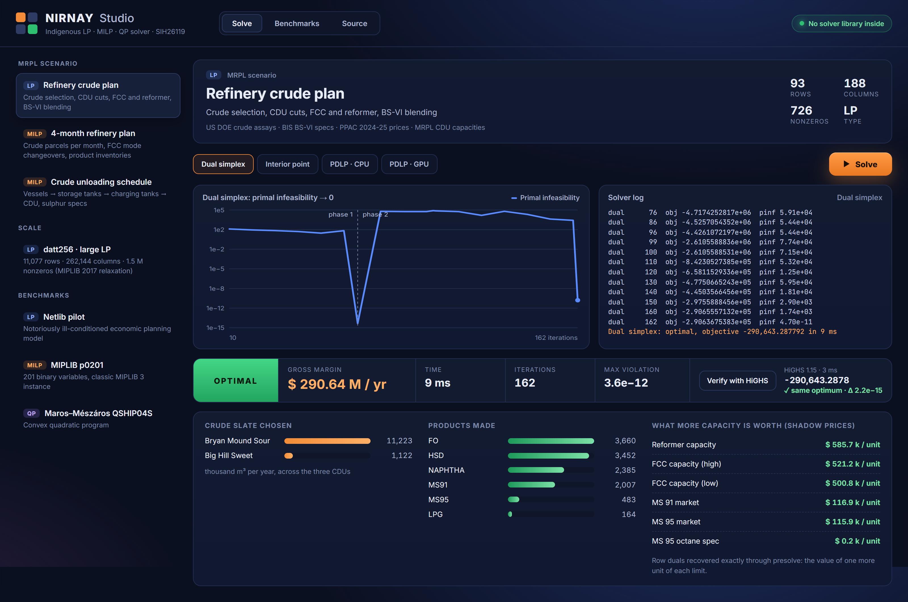</p>

<table>
<tr>
<td width="50%"><b>Four months ahead (MILP).</b> Branch-and-bound closes the gap between the best plan
found and the best still possible, then proves it optimal.<br>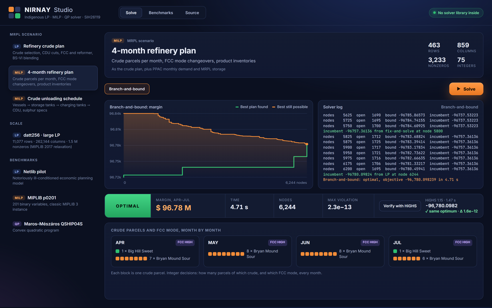</td>
<td width="50%"><b>Crude unloading schedule (MILP).</b> Lee et al. (1996): NIRNAY finds 79.75, exactly the
published optimum, and draws the schedule.<br>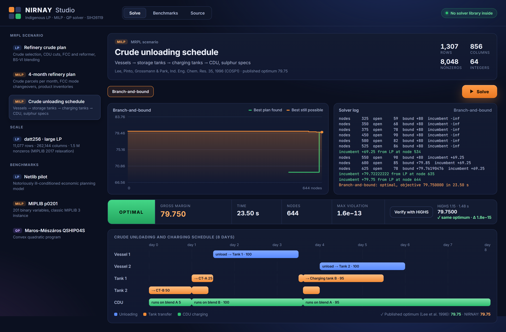</td>
</tr>
<tr>
<td width="50%"><b>Scale on the GPU.</b> A 1.5-million-nonzero LP in about a second on a laptop GPU;
HiGHS takes 259 s on the same machine.<br>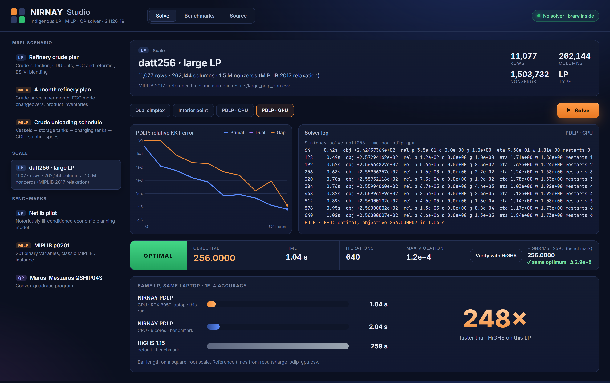</td>
<td width="50%"><b>Nothing borrowed.</b> The Source tab scans every import in <code>nirnay/</code>: zero
optimisation libraries.<br>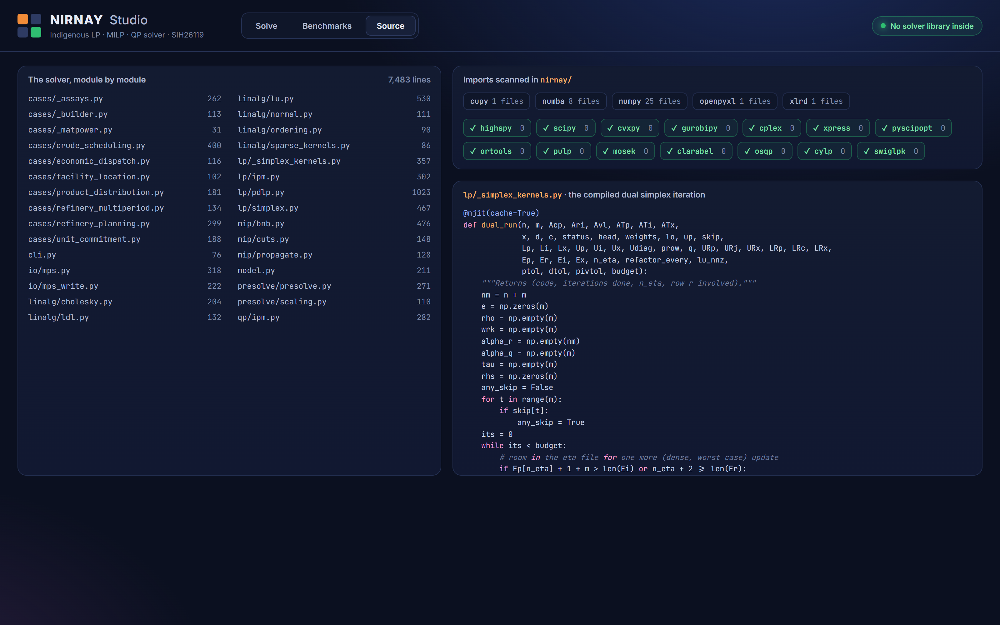</td>
</tr>
</table>

## Results at a glance

Measured on one laptop (Intel i5-11400H 6-core, 8 GB RAM, NVIDIA RTX 3050 Laptop 4 GB). Each instance runs
in its own process; the reference solver re-solves the same file and the relative objective error
and constraint violations are logged. Raw data: [`results/`](results/).

| Benchmark set | What it tests | NIRNAY | Reference |
|---|---|---|---|
| **Netlib LP** (90 problems) | the classic, numerically hard LP collection | **90 / 90** (dual simplex) · 86 / 90 (interior point) | HiGHS 90 |
| **MIPLIB 3** (64 problems, 60 s each) | mixed-integer programs | **33 / 64** proven optimal, **0 wrong** | HiGHS 47 |
| **Maros–Mészáros QP** (138 problems) | convex quadratic programs | **121 / 138** | Clarabel 122 |
| **Large LPs** (up to 13.6 M nonzeros) | GPU first-order method | datt256 in **0.8 s** on the GPU | HiGHS 259 s |

<p align="center">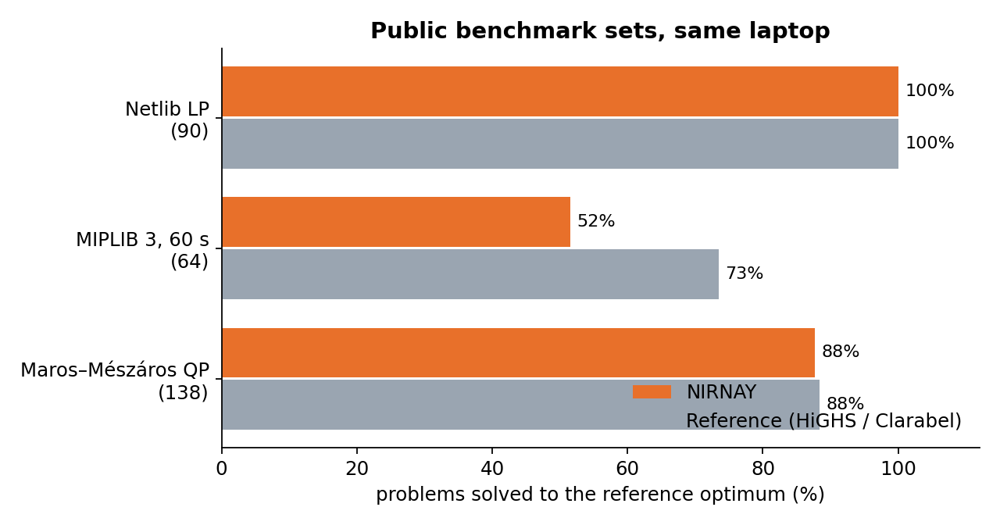</p>

**Correctness is the bar, not the headline.** "Solved" means the reference solver's optimum is
matched to 1e-6 relative (1e-4 for MILP, which is the standard gap) *and* the solution satisfies
every row and bound. LP duals are exact too: [`tools/dual_check.py`](tools/dual_check.py) finds no
primal or dual infeasibility on any Netlib problem it checks.

### Where the GPU pays

PDLP needs only matrix–vector products, which is what a GPU does well. On large LPs at 1e-4 accuracy,
a 4 GB laptop GPU is faster than HiGHS on 6 of the 7 instances where both finish — by up to ~320×
(datt256) — and 1.2–5.8× faster than our own multi-core CPU implementation. On small, hard LPs it is
not, so it is one engine of three, not the default.

<p align="center">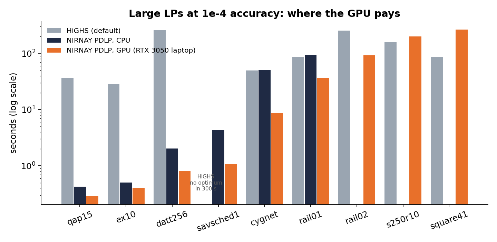</p>

### Honest about speed

On Netlib the dual simplex is slower than HiGHS (15 years of tuned C++) — about **2.6× in shifted
geometric mean**, and never faster on a single instance. The performance profile shows exactly
where we stand. The numerical kernels are compiled to native code with Numba; the whole simplex
iteration now runs in one compiled kernel, and hyper-sparse solves and a Markowitz LU are next.

<p align="center">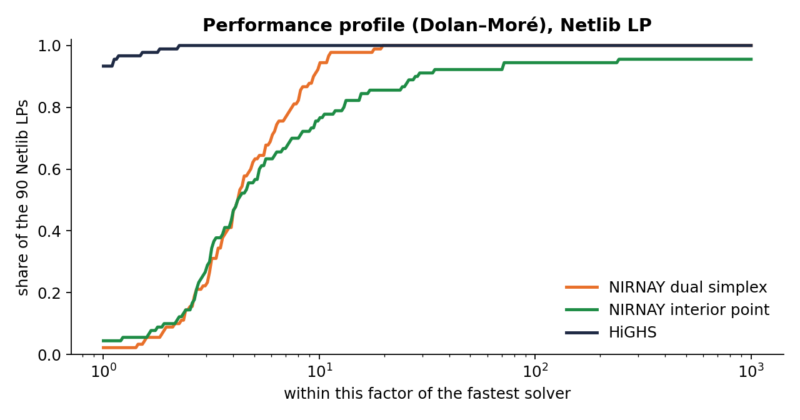</p>

MILP: every instance ends with a proven bound, even when the 60 s limit stops the search.

<p align="center">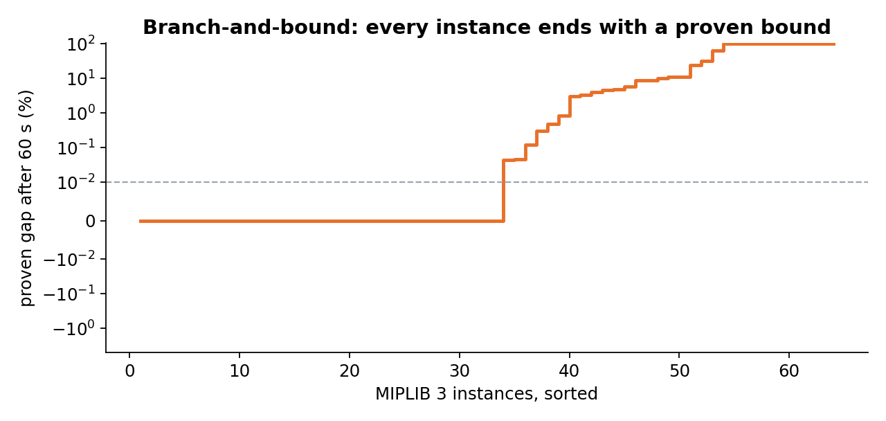</p>

## The idea deck

Built in the team's SIH template; the numbers on the slides are read from `results/` at build time
([`build_from_template.py`](deliverables/deck/build_from_template.py)).

<p align="center">
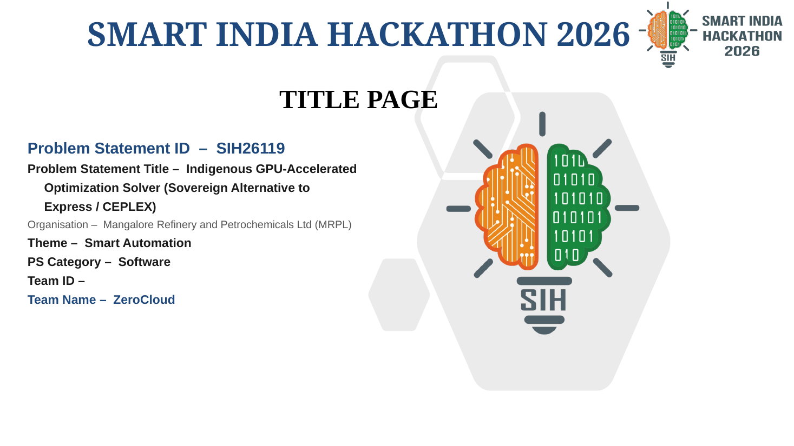
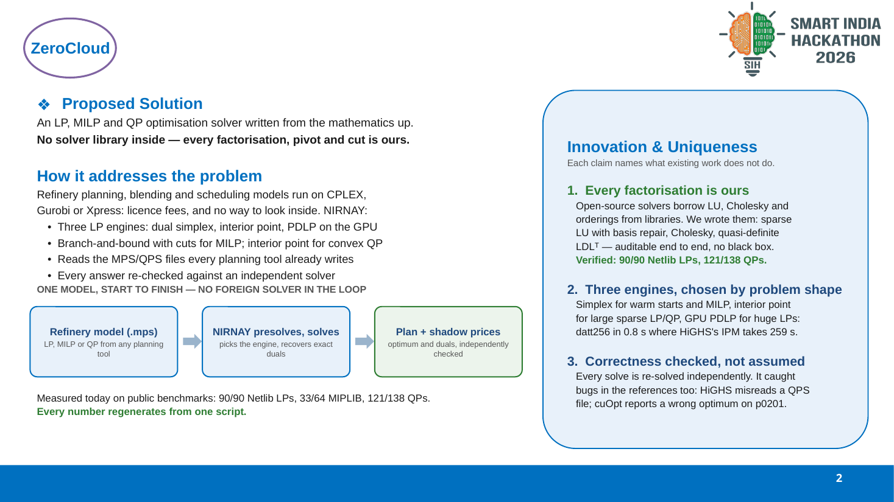
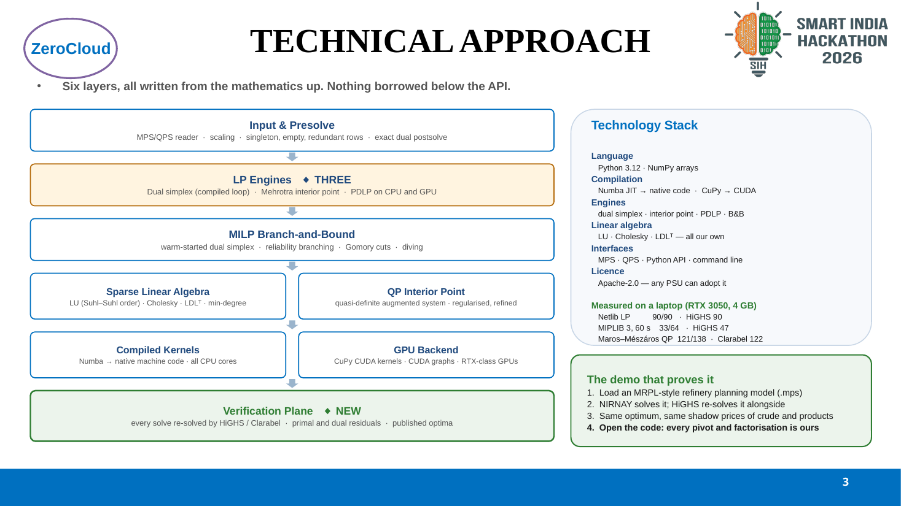
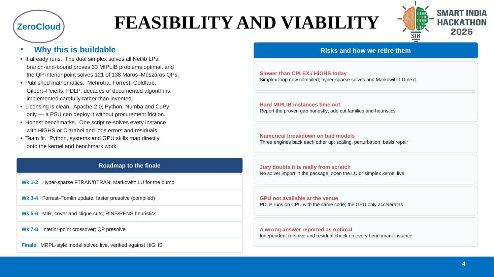
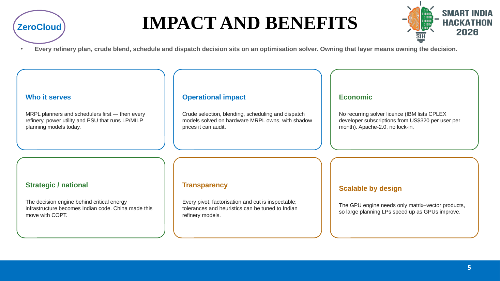
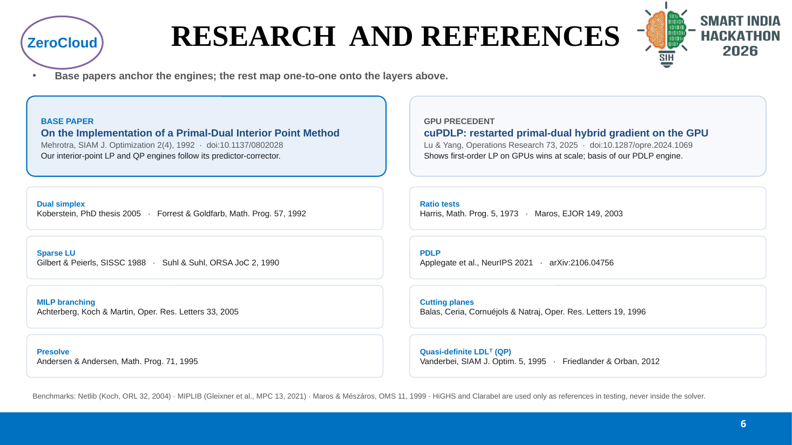
</p>

## Architecture

<p align="center">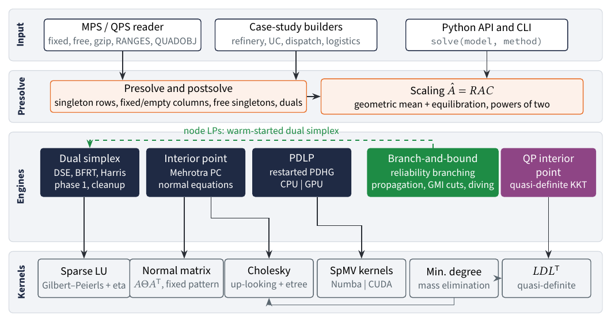</p>

| Layer | Module | What it does |
|---|---|---|
| Input | [`io/mps.py`](nirnay/io/mps.py), [`io/mps_write.py`](nirnay/io/mps_write.py) | MPS/QPS reader and writer: fixed and free format, gzip, all bound types, RANGES, QP sections. Matches HiGHS on every LP/MIP file and reads 4 QPS files *more* correctly than HiGHS does. |
| Presolve | [`presolve/presolve.py`](nirnay/presolve/presolve.py), [`scaling.py`](nirnay/presolve/scaling.py) | Singleton, empty and redundant rows; fixed, empty and free-singleton columns; integer bound propagation; exact primal **and dual** postsolve. Power-of-two geometric scaling. |
| Dual simplex | [`lp/simplex.py`](nirnay/lp/simplex.py), [`_simplex_kernels.py`](nirnay/lp/_simplex_kernels.py) | Bounded dual simplex: Fourer phase 1, dual steepest edge, bound-flipping ratio test with Harris' two passes, cost perturbation and shifting, primal clean-up. The whole iteration is one compiled kernel. |
| Interior point | [`lp/ipm.py`](nirnay/lp/ipm.py) | Mehrotra predictor–corrector on the normal equations, with regularisation and stall detection. |
| PDLP (CPU + GPU) | [`lp/pdlp.py`](nirnay/lp/pdlp.py) | Restarted primal–dual hybrid gradient: Ruiz and Pock–Chambolle scaling, adaptive steps, restarts, Farkas certificates; CUDA kernels replayed as CUDA graphs via CuPy. |
| MILP | [`mip/bnb.py`](nirnay/mip/bnb.py), [`cuts.py`](nirnay/mip/cuts.py), [`propagate.py`](nirnay/mip/propagate.py) | Branch-and-bound on the warm-started dual simplex: reliability branching, Gomory mixed-integer cuts, bound propagation, diving heuristics. |
| QP | [`qp/ipm.py`](nirnay/qp/ipm.py) | Interior point on the regularised quasi-definite augmented system, with residual-checked KKT solves. |
| Linear algebra | [`linalg/`](nirnay/linalg/) | Gilbert–Peierls sparse LU with Suhl–Suhl triangular ordering, basis repair and eta updates; up-looking sparse Cholesky; quasi-definite LDLᵀ; minimum-degree ordering. |

<table>
<tr>
<td width="50%">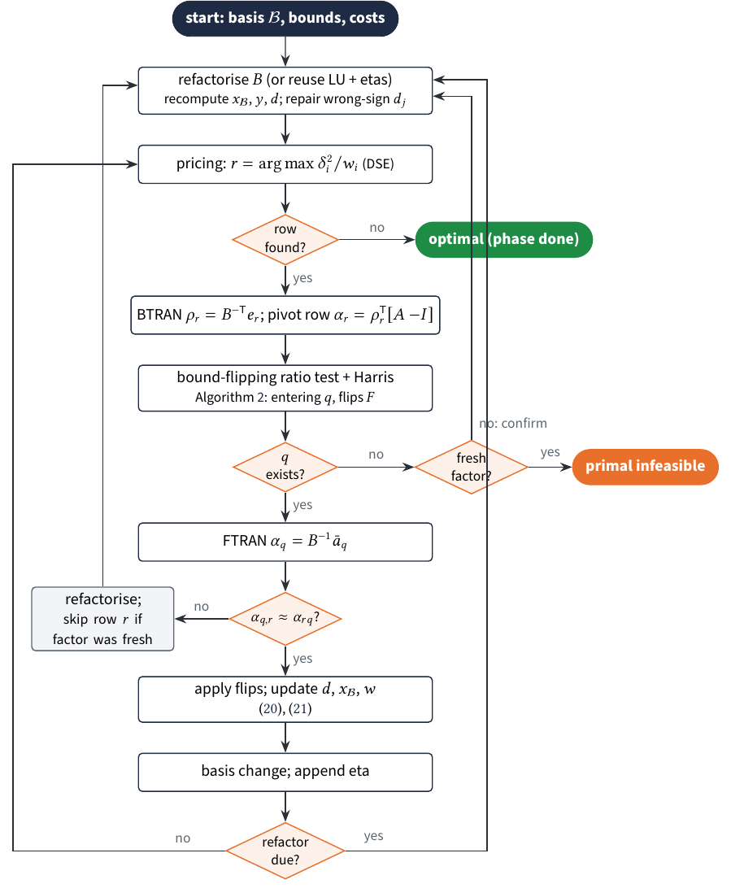<br><sub>One dual simplex iteration. Every path that could return a result on a doubtful factorisation refactorises first.</sub></td>
<td width="50%">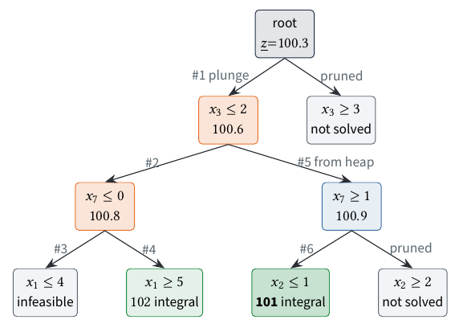<br><sub>Branch-and-bound: plunging, pruning by bound, best-bound selection.</sub><br><br>
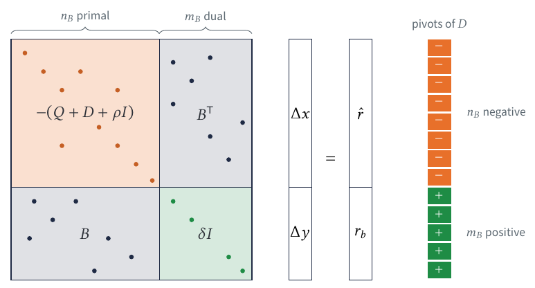<br><sub>The quasi-definite system each QP iteration factorises with our LDLᵀ.</sub></td>
</tr>
<tr>
<td colspan="2">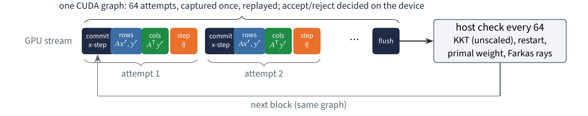<br><sub>PDLP on the GPU: 64 attempts per captured CUDA graph; the step-size decision never leaves the device.</sub></td>
</tr>
</table>

## Verified against the world's references — and it found their bugs

Every benchmark instance is solved twice: once by NIRNAY, once by an independent reference in a
separate process. Doing this carefully exposed problems in the references themselves:

| Found in | What | Evidence |
|---|---|---|
| HiGHS 1.15.1 | misreads the RHS section of `DPKLO1.QPS`; drops coefficients below 1e-9 in `KSIP`, `HUESTIS`, `HUES-MOD` | [`tools/qps_compare.py`](tools/qps_compare.py) — NIRNAY's reading reproduces the published optima |
| Clarabel 0.11 | at default tolerances ~1e-6 off on several QPs where NIRNAY matches the published optimum | [`bench/run_qp.py`](bench/run_qp.py) now uses 1e-11 tolerances |
| NVIDIA cuOpt 26.8 | reports "optimal" 7665 on MIPLIB `p0201`; the optimum is 7615 (4 of 4 runs) | [`docs/COMPETITOR_ANALYSIS.md`](docs/COMPETITOR_ANALYSIS.md) |
| HiGHS 1.15.1 PDLP | stops at limit/1000 s whenever a finite time limit is set | same |

And in our own code, every numerical failure found on the benchmarks was traced to its cause and
fixed with a regression test — false infeasibility from a wrong Harris bound, cycling in phase 1,
order-dependent postsolve duals, a KKT solve that was finite but wrong, scaling wrecked by a 1e-30
coefficient, a PDLP termination test fooled by huge right-hand sides. Section 11 of the
[report](deliverables/report/main.pdf) walks through each one.

## Industrial case studies

Seven models built from public data, each with a reference optimum ([details](docs/CASE_STUDIES.md)):

| Case | Type | Data | NIRNAY today |
|---|---|---|---|
| Refinery planning | LP, 93 × 188 | US DOE crude assays, BIS BS-VI specs, PPAC 2024-25 prices, MRPL capacities | ✅ optimal (matches HiGHS to 2e-14) |
| Product distribution | LP, 114 × 1,512 | PPAC state-wise MS/HSD sales, refinery throughput | ✅ optimal (2e-16) |
| Economic dispatch | QP, 9,266 × 5,871 | PGLib-OPF case2000 (matches published 9.4304e5) | ✅ optimal (6e-11) |
| Multi-period refinery plan | MILP, 1,391 × 2,579 | as above + PPAC monthly demand | ⏳ beyond the 120 s budget today |
| Crude oil scheduling | MILP | Lee et al. 1996 (minlp.org) | ⏳ |
| Unit commitment | MILP, 39k × 45k | PGLib-UC RTS-GMLC | ⏳ |
| Facility location | MILP, 101k × 100k | OR-Library capb | ⏳ |

## Quick start

```bash
git clone <this repo> && cd nirnay
pip install -e .                 # numpy + numba;  optional: pip install -e ".[gpu,bench]"
nirnay solve model.mps           # LP -> dual simplex, MILP -> branch-and-bound, QP -> interior point
nirnay solve model.mps --method pdlp-gpu --time-limit 300
nirnay info  model.mps
```

```python
from nirnay import solve
from nirnay.io.mps import read_mps

r = solve(read_mps("afiro.mps.gz"))          # method="auto"
print(r.status, r.objective)                 # optimal -464.7531428571
x, y, z = r.x, r.y, r.z                      # primal values, row duals (shadow prices), reduced costs
```

### Reproduce every number

```bash
python bench/run_lp.py  data/netlib --method simplex --limit 240 --out results/netlib_simplex.csv
python bench/run_mip.py data/miplib --limit 60  --out results/miplib3_bnb.csv
python bench/run_qp.py  data/qp/mm  --limit 120 --out results/maros_qp.csv
python bench/run_pdlp_gpu.py data/large --tol 1e-4 --limit 300
python -m pytest tests -q                     # regression tests against published optima
python tools/make_figures.py                  # the charts in this README
python deliverables/report/gen_data.py        # then latexmk in deliverables/report -> main.pdf
python deliverables/deck/build_from_template.py
```

Benchmark files are downloaded, not versioned: Netlib and MIPLIB 3 from the lists in `data/`,
Maros–Mészáros from `doc.ic.ac.uk/~im/QPDATA{1,2,3}.ZIP`, large LPs from Mittelmann's and MIPLIB 2017's sites.

## Repository map

```
nirnay/        the solver (≈ 7,500 lines of Python + Numba + CUDA kernels)
  io/ presolve/ linalg/ lp/ mip/ qp/ cases/ cli.py
bench/         benchmark harnesses (process-isolated, reference re-solve), comparator driver
tests/         regression tests against published optima
demo/studio/   NIRNAY Studio: local web front end (FastAPI + SVG charts), screenshot script
tools/         dual feasibility checker, QPS cross-check, figure generation, comparator demos
results/       every benchmark run as CSV + log
docs/          case studies, competitor analysis, jury Q&A, images
deliverables/
  deck/        SIH idea deck (template build script + rendered slides)
  report/      LaTeX technical report (TikZ, PGFPlots, forest), sources + main.pdf
```

## Known limitations

- **Speed:** slower than HiGHS on LP; fewer MIPLIB solves (one cut family, simple heuristics, serial tree).
- **QP:** about a dozen degenerate Maros–Mészáros problems fail (LISWET family, YAO, UBH1, KSIP); on most of them Clarabel only reaches "almost solved" as well. No crossover from interior point to a vertex yet.
- **Presolve:** the classic reductions only; doubleton, dominated-column and parallel-row reductions are next. QPs are not presolved.
- **PDLP:** first-order accuracy (1e-4 by default); it is the engine for very large LPs, not for small hard ones.

The roadmap (report §16): hyper-sparse FTRAN/BTRAN and a Markowitz LU → MIR, cover and clique cuts
with RINS/RENS → interior-point crossover → an MRPL planning model solved live against HiGHS.

## References

The primary source for every algorithm is cited in its module docstring and in the report's
bibliography — among them Mehrotra (1992), Forrest & Goldfarb (1992), Harris (1973), Maros (2003),
Koberstein (2005), Gilbert & Peierls (1988), Suhl & Suhl (1990), Vanderbei (1995),
Andersen & Andersen (1995), Achterberg, Koch & Martin (2005), Balas et al. (1996),
Applegate et al. (2021) and Lu & Yang (2025).

<p align="center">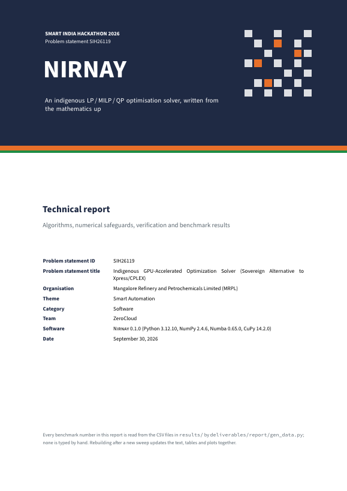</p>

---

<sub>Apache-2.0 · Team ZeroCloud · Smart India Hackathon 2026. HiGHS, Clarabel, SCIP, OR-Tools, GLPK,
CBC, OSQP and cuOpt are used only in `bench/`, `tools/` and the Studio's Verify button as references;
nothing under `nirnay/` imports them (the Studio's Source tab checks this).</sub>
